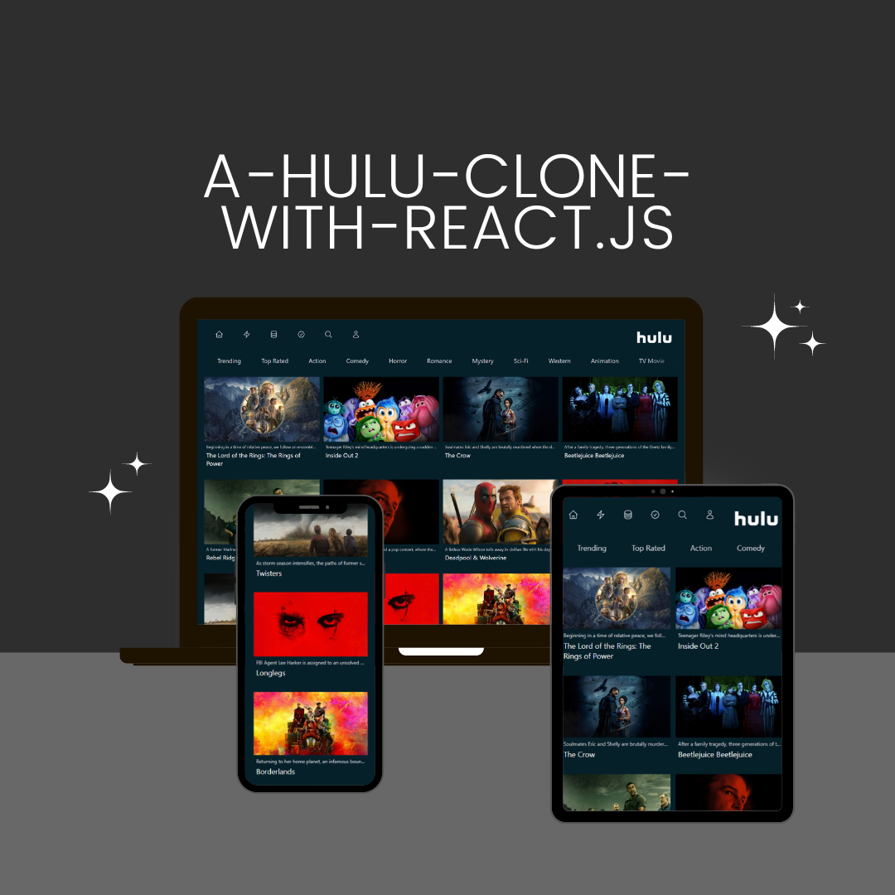

# Hulu Clone with REACT.JS

Welcome to the **Hulu Clone** project! This is a web application built with **Next.js**, **React.js**, and **Tailwind CSS**. Our goal is to recreate a Hulu-like user interface with modern, responsive design principles.

## 📸 Editable Mockup

Here’s a mockup of the layout and design dimensions used in this project:



## 🌐 Live Demo

Check out the live demo of the project here: [Hulu Clone](https://a-hulu-clone-with-react-js-depi.vercel.app/)

## 🚀 Features

- **Next.js**: Server-side rendering and static site generation for fast, SEO-friendly performance.
- **React.js**: For building dynamic, interactive user interfaces.
- **Tailwind CSS**: Utility-first CSS framework for custom, responsive styling.
- **Responsive Design**: Optimized for various screen sizes including mobile, tablet, and desktop.

## 🛠️ Getting Started

First, clone the repository and navigate to the project directory:

```bash
git clone https://github.com/yourusername/hulu-clone.git
cd hulu-clone
```
```bash
cd hulu-clone
Install Dependencies
```

```bashv
npm install
Run the Development Server
```

```bash
npm run dev
Your application should now be running at http://localhost:3000.
```

🗂️ Project Structure
pages/: Contains the application's routes.
components/: Reusable React components.
public/: Static files like images and fonts.
styles/: Custom CSS and Tailwind configurations.
📖 Usage
Homepage: Displays a list of movies and shows similar to Hulu.
Search Functionality: Allows users to search for content.
Responsive Design: Adjusts layout for different devices.
🔧 Customization
Feel free to customize the project by modifying components, styles, and configurations. For instance, you can update the mockup image located in public/images/mockup.png.

📄 License
This project is licensed under the MIT License. See the LICENSE file for details.

📫 Contact
For any questions or feedback, feel free to reach out to nguyenphihung275202@gmail.com.

### Changes Made:
1. Fixed formatting issues in the "Getting Started" section.
2. Added a line to open the local development server URL.
3. Moved the "Learn More" section to its proper place and formatted it as a list.
4. Ensured that all sections are clearly separated and properly formatted.
5. Verified that the mockup image name should match exactly (`Edıtable-mockup.png`). Ensure the file name in your project matches this name.

